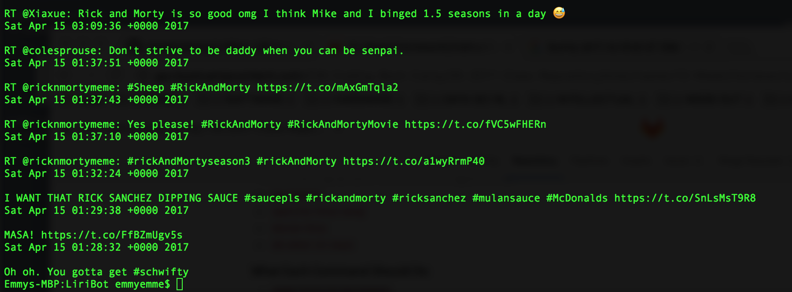
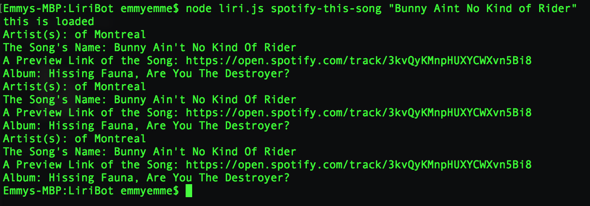
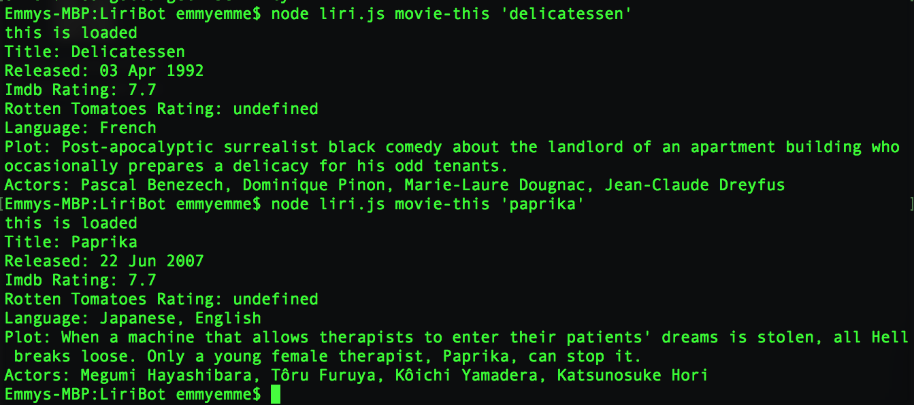

# LiriBot

LIRI is a Language Interpretation and Recognition Interface. LIRI is a command line node application that accepts parameter inputs and then outputs data to the user's terminal/bash window.

# Features

When user inputs `node liri.js my-tweets`, liri outputs user's last 20 tweets in user's terminal/bash window:

When user inputs `node liri.js spotify-this-song '<song name here>'` liri outputs the following information about the song in user's terminal/bash window: 

* Artist(s)
* The song's name
* A preview link of the song from Spotify
* The album that the song is from

When user inputs `node liri.js movie-this '<movie name here>'` liri outputs the following information about the movie in user's terminal/bash window:

* Title of the movie.
* Year the movie came out.
* IMDB Rating of the movie.
* Rotten Tomatoes Rating of the movie.
* Country where the movie was produced.
* Language of the movie.
* Plot of the movie.
* Actors in the movie.

